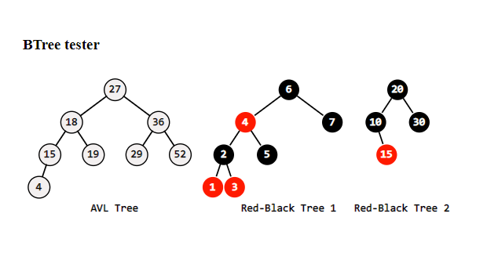

## adt
javascript abstract data types

pnpm install --save-dev ts-node
pnpm install --save-dev @types/chai @types/mocha

## graphs

	component: 1
	[0] start tree
	(0-5) tree 
   		[5] tree analized as:(0-5)
	(0-6) tree
		(6-9) tree
			(9-11) tree
        		(11-12) tree
            		[12] tree analized as:(11-12)
           		[11] tree analized as:(9-11)
       		(9-10) tree
           		[10] tree analized as:(9-10)
       		(9-12) down
       		[9] tree analized as:(6-9)
   		(6-4) tree
       		(4-9) cross
       		[4] tree analized as:(6-4)
   		[6] tree analized as:(0-6)
	(0-2) tree
   		(2-3) tree
       		(3-4) cross
       		(3-5) cross
       		[3] tree analized as:(2-3)
   		[2] tree analized as:(0-2)
	(0-3) down
	(0-1) tree
   		[1] tree analized as:(0-1)
	[0] tree analized as:(0-0)
	component: 2
	[7] start tree
	(7-6) cross
	[7] tree analized as:(7-7)
	component: 3
	[8] start tree
	(8-7) cross
	[8] tree analized as:(8-8)
	
	node:  0   1   2   3   4   5   6   7   8   9  10  11  12
	--------------------------------------------------------
	pre:   0  10   8   9   7   1   2  11  12   3   6   4   5
	st:    0   0   0   2   6   0   0   7   8   6   9   9  11
	post: 10   9   8   7   5   0   6  11  12   4   3   2   1

	Topological sort
	order:    5 > 12 > 11 > 10 >  9 >  4 >  6 >  3 >  2 >  1 >  0 >  7 >  8

## trees

	visulizeTree(t);

	    A
	 ┌──┴┬──┐
	 B   E  I
	┌┴┐  │
	C D  F
	    ┌┴┐
	    G H
	
	visulizeTree(t);

	     +
	   ┌─┴──┐
	   *    +
	 ┌─┴┐  ┌┴┐
	 A  -  D E
	┌┴┐
	B C

	pre-order:  + * A - B C + D E
	in-order:  A * B - C + D + E
	post-order:  A B C - * D E + +
	breathSearch:  + * + A - D E B C

	visulizeTree(t);

	           Art
       ┌────────┴──┬────────┐
       B           E        I
    ┌──┴──┐        │
    C     D        F
                ┌──┴──┐
                G     H
	
	pre order:    Art, B, C, D, E, F, G, H, I
	post order:   C, D, B, G, H, F, E, I, Art
	level order:  Art:1, B:2, E:2, I:2, C:3, D:3, F:3, G:4, H:4

### AVL & Red-Black Trees

